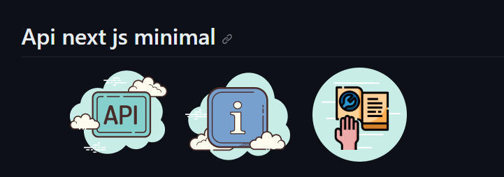

- [Como iniciar a api](#projeto-base)
- [Como adiciona um banco de dados a api](/mySql-conection/README.md)
- [Como adiciona o cors na api](/Cors/README.md)

## Sobre

O projeto teve origem na demanda por uma estrutura de API simplificada, caracterizada por sua simplicidade e eficiência. Seu principal objetivo é fornecer assistência aos desenvolvedores na criação de uma estrutura de API Next.js, com um conjunto mínimo de pacotes, prontamente utilizáveis e compatíveis com servidores que suportem Node.js.

Além disso, o projeto contempla a implantação em diferentes plataformas, sendo que uma delas já está plenamente suportada:

- Implantação no Netlify ✅

Este empreendimento visa simplificar a vida dos desenvolvedores, permitindo-lhes criar APIs com facilidade e agilidade, enquanto mantém um alto padrão de qualidade.

## Participantes

- [@marco antonio](https://github.com/marco0antonio0)

# Como iniciar uma api next minimal pacotes (estrutura base)

### > deploy netlify como api ✅

### > funcionando corretamente para deploy ✅

### > next js versão para poder funcionar no netlify >> 13.4.19 ✅

## Projeto base

**Passo 1: Inicialização do Projeto**
Crie um novo diretório para o seu projeto e acesse-o:

```bash
mkdir meu-projeto-api-nextjs
cd meu-projeto-api-nextjs
```

Inicialize um novo projeto Node.js:

```bash
npm init -y
```

Configure o package.json com os scripts necessários:

```json
"scripts": {
  "dev": "next",
  "build": "next build",
  "start": "next start"
}
```

**Passo 2: Instalação do Next.js**
Execute o seguinte comando para instalar o Next.js, React e React DOM:

```bash
npm install next@13.4.19 react react-dom
```

**Passo 3: Criação da Estrutura de Diretórios**
Crie a seguinte estrutura de diretórios:

```Mardown
meu-projeto-api-nextjs/
  |-- pages/
  |    |-- api/
  |         |-- exemplo.js
```

### comando rapido de criação

```bash
mkdir -p pages/api
```

**Passo 4: Criação de uma Rota de API de Exemplo**
Dentro do diretório api, crie um arquivo chamado exemplo.js para criar uma rota de API de exemplo:

```javascript
// api/exemplo.js

export default function handler(req, res) {
  res.status(200).json({ message: "Esta é uma rota de API de exemplo" });
}
```

**Passo 5: Inicialização do Servidor de Desenvolvimento**
Execute o seguinte comando para iniciar o servidor de desenvolvimento:

```bash
npm run dev
```

Isso iniciará seu aplicativo Next.js em http://localhost:3000.

**Passo 6: Acesso à Rota de API**
Abra seu navegador ou use uma ferramenta como o Postman para acessar a rota de API de exemplo em http://localhost:3000/api/exemplo
